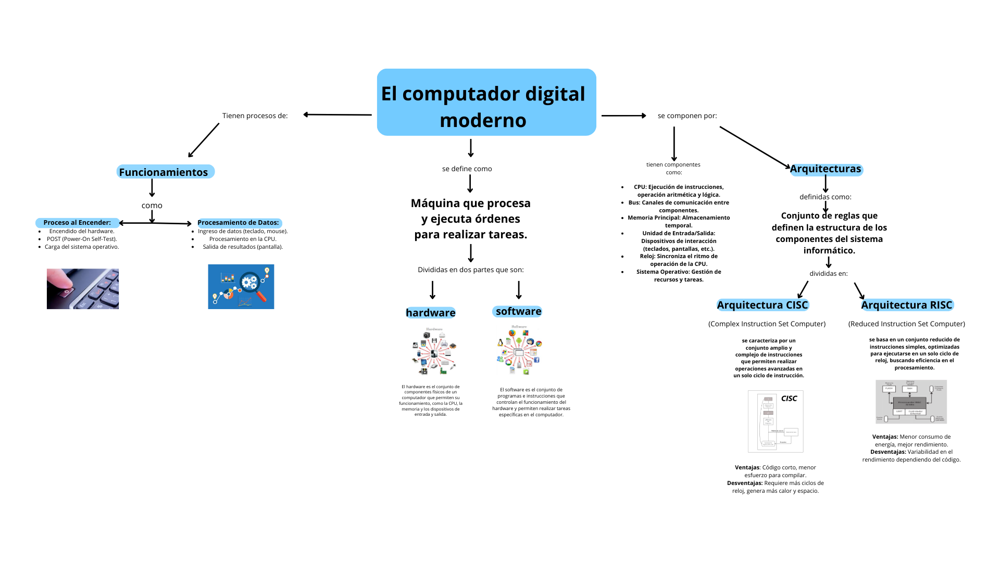

# Unidad No. 
## Información del estudiante  
Nombre del estudiante: Luna Michelle Torres Nuñez
Id.: 00568004
---
# Sabado 8 de febrero 2025
Primeramente realizamos un documento markdown en el cual colocamos una investigacion sobre los computadores modernos y sus arquitecturas, incluimos imagenes para hacerlo grafico y además de ello tablas para comparar datos o informacion relevante, tenemos como resumen de nuestra investigacion este pequeño fragmento:

El computador es una máquina que procesa y ejecuta órdenes mediante hardware (componentes físicos) y software (programas y sistemas operativos). Su arquitectura define cómo están organizados sus componentes, desde la CPU (cerebro del sistema), la memoria, los buses de comunicación y dispositivos de entrada/salida, hasta el sistema operativo.

Existen dos principales arquitecturas de procesadores:

- CISC (Complex Instruction Set Computer): Usa instrucciones complejas, requiere menos memoria RAM y es común en procesadores Intel y AMD.
- RISC (Reduced Instruction Set Computer): Emplea instrucciones más simples y rápidas, es eficiente en energía y se usa en dispositivos ARM como smartphones y Raspberry Pi.

El hardware incluye CPU, memoria RAM/ROM, almacenamiento (discos duros, SSD), placa base y periféricos. Mientras que el software se divide en software de sistema (como los sistemas operativos), software de aplicación y software de desarrollo.

El funcionamiento del computador inicia con el proceso de encendido, que incluye la verificación del hardware, carga del sistema operativo y procesamiento de datos en código binario. Los datos se representan en unidades como bit, byte, KB, MB, hasta PB.

Conociendo esto decidí realizar un mapa conceptual para que podamos sintetizar el contenido del documento:

# Domingo 9 de febrero 2025 
Actividad 2: Representación de Datos Digitales

1. **¿Cuántos estados diferentes se pueden representar usando N bits?**
La representación de datos en sistemas digitales se basa en el uso de bits, las unidades fundamentales de información en la computación. Un bit puede adoptar uno de dos valores: 0 o 1. Cuando se combinan múltiples bits, se pueden representar múltiples estados diferentes, lo cual es esencial en el diseño de sistemas electrónicos y en la codificación de información.

El número de estados diferentes que se pueden representar utilizando N bits viene dado por la expresión matemática:

\[ S = 2^N \]

Donde:
- \( S \) es el número total de estados posibles.
- \( N \) es el número de bits utilizados.

Por ejemplo, si N = 3, el número de estados posibles es:

\[ S = 2^3 = 8 \]

Estos estados corresponden a los valores binarios del 000 al 111.

El fundamento de esta fórmula proviene de la teoría de combinaciones. Cada bit tiene dos posibles valores (0 o 1), y dado que los bits son independientes entre sí, el número total de combinaciones posibles en una palabra binaria de \( N \) bits es:

\[ S = 2 \times 2 \times ... \times 2 \] (N veces)

Esto se puede expresar de forma compacta como una potencia de base 2:

\[ S = 2^N \]

Esta fórmula es ampliamente utilizada en sistemas digitales para determinar la capacidad de representación de registros, memoria y direccionamiento de dispositivos electrónicos.

El número de estados diferentes que se pueden representar con una palabra de N bits está dado por \( 2^N \). Este principio es fundamental en la computación y en la electrónica digital, ya que permite estimar la capacidad de almacenamiento, la cantidad de direcciones posibles en una memoria y el número de combinaciones en circuitos lógicos.

## ¿Cómo se representan los datos en una computadora?
Los datos en una computadora se representan en formato binario, es decir, mediante combinaciones de los dígitos 0 y 1. Los números se almacenan directamente en este sistema, mientras que las letras y otros caracteres se codifican utilizando estándares como ASCII o Unicode. Las imágenes, sonidos y videos también se digitalizan, transformando su información en secuencias de bits que la computadora puede procesar, almacenar y transmitir.

## ¿Cuáles son las unidades de almacenamiento de datos que se utilizan en computación?
En computación, las unidades de almacenamiento se organizan en múltiplos del byte, con prefijos específicos que indican la cantidad de información almacenada. A continuación, se muestra una tabla con las principales unidades:

| Unidad   | Símbolo | Equivalencia |
|----------|--------|-------------|
| Byte     | B      | 8 bits      |
| Kilobyte | KB     | 1024 bytes  |
| Megabyte | MB     | 1024 KB     |
| Gigabyte | GB     | 1024 MB     |
| Terabyte | TB     | 1024 GB     |
| Petabyte | PB     | 1024 TB     |
| Exabyte  | EB     | 1024 PB     |
| Zettabyte| ZB     | 1024 EB     |
| Yottabyte| YB     | 1024 ZB     |

## Importancia del Trabajo de George Boole

El trabajo de George Boole en el desarrollo del álgebra booleana sentó las bases para la lógica computacional moderna. Su sistema de operaciones lógicas (AND, OR, NOT) es esencial en el diseño de circuitos digitales y en la programación, permitiendo que las computadoras procesen información de manera eficiente y lógica. 

El álgebra booleana es fundamental en la construcción de puertas lógicas, que son los bloques básicos de los circuitos electrónicos y procesadores modernos. Sin este desarrollo, el diseño de hardware y software tal como lo conocemos hoy no sería posible. Además, el modelo lógico de Boole se aplica en bases de datos, en la optimización de búsquedas en motores como Google y en el desarrollo de inteligencia artificial.

Gracias a su contribución, la informática evolucionó hacia sistemas capaces de realizar cálculos complejos y automatizar procesos con alta precisión, lo que ha impulsado el avance tecnológico en múltiples disciplinas como la robótica, la ciberseguridad y el análisis de datos.

## Ejericicio # 2
- 1010101010₂ = 682
- 11111₂ = 31
- 10000000₂ = 128
- 100100100₂ = 292
-----
- 127₁₀ = 1111111₂
- 246₁₀ = 11110110₂
- 1025₁₀ = 10000000001₂
- 354₁₀ = 101100010₂

## Preguntas para reflexionar de la actividad 2, unidad 2

### Actividad: tipos de datos en los lenguajes de programación.

| Tipo de Dato  | C         | Python   | Java       | JavaScript  |
|--------------|----------|---------|-----------|------------|
| Entero       | int      | int     | int       | Number     |
| Decimal      | float    | float   | float, double | Number     |
| Carácter     | char     | str     | char      | String     |
| Cadena       | char[] / string | str | String    | String     |
| Booleano     | _Bool    | bool    | boolean   | Boolean    |

- Tabla organizada

| Nombre de la Variable | Abreviación | Características Principales |
|----------------------|-------------|-----------------------------|
| Entero              | int         | Almacena números enteros (positivos y negativos). |
| Decimal             | float       | Representa números con punto flotante (valores decimales). |
| Carácter            | char        | Almacena un solo carácter en lenguajes como C y Java. |
| Cadena              | str / string| Representa una secuencia de caracteres. |
| Booleano            | bool        | Solo puede tomar los valores true o false. |

### Actividad: Calcúlo de Espacio de Memoria

Se almacena la información cada 10 segundos durante 24 horas. Vamos a calcular cuánto espacio total se requiere en memoria para almacenar estos datos.

#### **Paso 1: Tamaño de los datos**

1. **Identificador numérico (número entero):**
   - Un número entero ocupa **4 bytes** (32 bits).

2. **Temperatura (valor de punto flotante):**
   - Un número de punto flotante ocupa **4 bytes**.

3. **Valor lógico (dato booleano):**
   - Un valor booleano ocupa **1 byte**.

4. **Texto con 10 caracteres:**
   - Un carácter ocupa **1 byte** en ASCII, por lo que el texto de 10 caracteres ocupará **10 bytes**.

#### **Paso 2: Datos almacenados cada 10 segundos durante 24 horas**

1. **Número de intervalos de 10 segundos en 24 horas:**
   - 24 horas = 24 * 60 * 60 = **86,400 segundos**.
   - Número de intervalos de 10 segundos = **86,400 / 10 = 8,640 intervalos**.

2. **Espacio ocupado por un conjunto de datos:**
   - Identificador numérico: 4 bytes
   - Temperatura: 4 bytes
   - Valor lógico: 1 byte
   - Texto: 10 bytes

   Total por conjunto de datos = **4 + 4 + 1 + 10 = 19 bytes**.

#### **Paso 3: Calcular el espacio total para 8,640 intervalos**

El espacio total requerido será:

\[
\text{Espacio total} = \text{Espacio por conjunto de datos} \times \text{Número de intervalos}
\]

\[
\text{Espacio total} = 19 \text{ bytes} \times 8,640 \text{ intervalos} = 164,160 \text{ bytes}
\]

#### **Paso 4: Convertir a unidades más grandes**

1 KB = 1,024 bytes, 1 MB = 1,024 KB, 1 GB = 1,024 MB.

\[
\text{Espacio total en KB} = \frac{164,160}{1,024} \approx 160 \text{ KB}
\]

\[
\text{Espacio total en MB} = \frac{160}{1,024} \approx 0.15625 \text{ MB}
\]

#### **Resultado final**

El espacio total requerido en memoria para almacenar esta información durante 24 horas es aproximadamente **160 KB** o **0.156 MB**.

### Conclusión del Trabajo Hecho
### **Conclusión**

A lo largo de esta actividad, hemos explorado cómo las computadoras representan y almacenan datos utilizando el sistema binario. Aprendimos que, mientras los humanos utilizamos un sistema decimal para manejar los números, las computadoras dependen de bits (0 y 1) que se combinan para formar bytes y palabras binarias, permitiendo una representación eficiente y precisa de la información.

Además, abordamos el concepto de la lógica booleana, esencial en el procesamiento de decisiones dentro de los sistemas computacionales, y cómo los valores booleanos (verdadero o falso) se utilizan en la programación y el diseño de circuitos lógicos. A través de ejercicios prácticos, aprendimos a convertir números entre sistemas binarios y decimales, consolidando nuestra comprensión de cómo se manejan los datos en las computadoras.

El trabajo de George Boole, al establecer las bases de la lógica booleana, ha sido fundamental en la creación de los lenguajes de programación y circuitos electrónicos modernos, haciendo posible el procesamiento digital de datos. Este conocimiento es crucial para desarrollar software, ya que permite representar y manipular datos de manera eficiente a través de la lógica binaria.

En resumen, esta actividad nos ha ayudado a comprender la importancia de la representación binaria en las computadoras, cómo la información se traduce en datos procesables y cómo diferentes tipos de datos, como números, texto e imágenes, son representados y almacenados en los sistemas digitales.

# CONSULTA ACTIVIDAD 3 
# 📌 Ejercicio 1: Símbolos en Diagramas de Flujo

## Símbolos Correctos

1. **Inicio/Fin:** Óvalo.
2. **Entrada/Salida:** Paralelogramo.
3. **Proceso:** Rectángulo.
4. **Decisión:** Rombo.
5. **Conector:** Círculo pequeño.

**Sustentación:**  
Estos símbolos son los que encontré en varias fuentes confiables, como manuales de programación básica y libros de introducción a algoritmos. Además, los repasamos en clase con el profe y son los mismos que vienen en las guías. Son estándares internacionales, por eso es seguro que son correctos.

---

## Parte 1: Identificar Algoritmos

1. **Una página web:**  No.  
Una página web es más como un producto final, no un conjunto de pasos secuenciales para resolver un problema específico.

2. **Una receta para hacer un pastel:**  Sí.  
Es un proceso con pasos definidos, instrucciones claras y un resultado esperado, justo como un algoritmo.

3. **"Piensa en un número y multiplícalo por otro":**  No.  
No es lo suficientemente preciso ni tiene una secuencia clara. Un algoritmo debe ser detallado, no una idea vaga.

4. **Un manual de instrucciones para armar un mueble:**  Sí.  
Es una secuencia lógica y detallada que lleva a un objetivo claro (armar el mueble).

5. **Una lista de compras en orden alfabético:**  No.  
Es solo un listado, no una secuencia de pasos para resolver algo.

---

## Parte 2: Variables y Constantes

1. **Gravedad (9.8 m/s²):**  Constante.  
Es un valor fijo, no cambia.

2. **Edad de una persona:**  Variable.  
Cambia cada año, es un dato dinámico.

3. **Dinero en una cuenta bancaria:**  Variable.  
Cambia con cada depósito o retiro.

4. **Velocidad de la luz (299,792,458 m/s):**  Constante.  
Es un valor que no cambia.

5. **Radio de un círculo:**  Variable.  
Depende de cada círculo, es diferente cada vez.

---

## Parte 3: Características de los Algoritmos

1. **Ruta más corta entre ciudades:**  Sí.  
Cumple con ser finito, claro y resolutivo. Está evaluando opciones y tomando decisiones lógicas.

2. **Suma de números y muestra resultado:**  Sí.  
Tiene entradas, procesos y salida clara. Es directo y cumple las características básicas.

3. **Área de un rectángulo:**  Sí.  
Son pasos ordenados para resolver algo específico.

4. **Contar votos por candidato:**  Sí.  
Es secuencial, con condiciones de inicio y fin, lo cual es parte clave de un algoritmo.

---

## Parte 4: Comprensión de Herramientas

1. **El pseudocódigo usa símbolos estándar:**  Falso.  
El pseudocódigo usa texto, no símbolos gráficos.

2. **Diagramas de flujo son representación gráfica de un algoritmo:**  Verdadero.  
Eso es justamente lo que son, una forma visual de representar el algoritmo.

3. **Pseudocódigo debe estar en un lenguaje específico:**  Falso.  
El pseudocódigo es flexible, no sigue un lenguaje de programación formal.

4. **Diagrama de flujo debe tener inicio y fin:**  Verdadero.  
Sin estos dos puntos no sería un diagrama de flujo correcto.

---

## Parte 5: Estructuras de Control

### ¿Para qué sirven?
Sirven para decidir qué hacer dependiendo de una condición o para repetir instrucciones si es necesario. Son como las reglas que hacen que el algoritmo sea flexible y se adapte a diferentes situaciones.

### Ejemplo vida diaria
Si veo que está lloviendo, llevo paraguas. Si no llueve, no lo llevo.

### Ejemplo matemático
Si quiero calcular si apruebo la materia, hago el promedio de mis calificaciones. Si el promedio es mayor o igual a 7, paso. Si es menor, repruebo.
