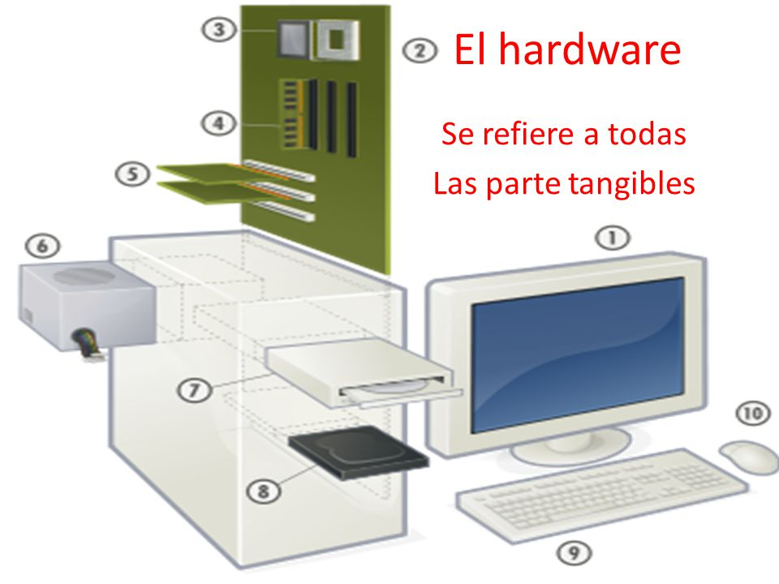
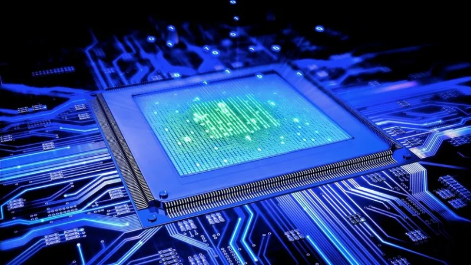
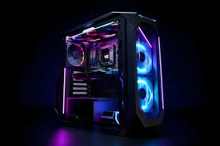
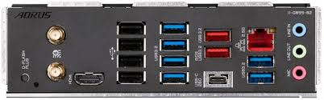
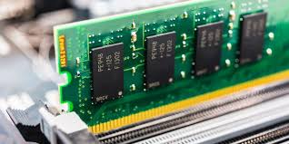
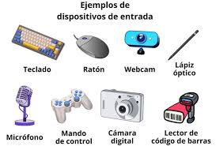
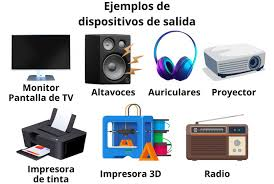
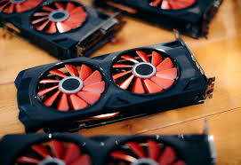
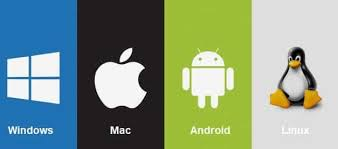

# El Computador Digital Moderno 

## Tabla de Contenido
|título|
|------|
|[¿qué es un computador?](#qué-es-un-computador-)|
|[Arquitectura de los Computadores](#arquitectura-de-los-computadores-️)|
|[funcionamiento del computador](#funcionamiento-del-computador)|
|[procesos al encender el computador](#procesos-al-encender-una-computadora)|
||

## ¿Qué es un Computador? 💻

El computador, también **conocido generalmente como ordenador o computadora**, es una compleja máquina que procesa y ejecuta órdenes de diversa índole para dar como resultado un sinfín de tareas distintas. Creada hace muchas décadas, este aparato sigue en constante evolución y es uno de los inventos más populares de la historia, ocupando un lugar en casi todos los hogares del mundo.

Al igual que el cuerpo humano, la computadora **necesita de una parte material, tangible y visible para funcionar**, pero también de ideas, funciones y un “alma” que no se puede ver. Ambas cosas reciben el nombre de hardware y software.

El hardware son los elementos físicos (periféricos) como el teclado, el ratón, la pantalla o monitor, los cables, plaquetas y todo tipo de elementos que forman al computador de manera sólida. Pero en su interior, grabado en la memoria, encontramos **el software, que son los programas, sistemas operativos y funciones instaladas** que le dan vida y coordinan lo material para funcionar. [1]

## Arquitectura de los Computadores 🛠️ 

### ¿Qué es?
Se trata de un conjunto de reglas, principios y estándares que definen la estructura y el diseño de los componentes de hardware y software que conforman un sistema informático. Esta disciplina abarca desde el nivel más bajo, como los circuitos electrónicos y la lógica digital, hasta el nivel más alto, como lo son los sistemas operativos y las aplicaciones.

En tal sentido, **la arquitectura de computadoras constituye la base conceptual y técnica que admite la creación de ordenadores y sistemas informáticos funcionales**. Incluye la forma en que los componentes se comunican entre sí, la manera en que se gestionan los recursos, cómo se ejecutan las instrucciones, así como el procedimiento de almacenar y acceder a los datos.[2]

### Componentes Fundamentales de la Arquitectura de Computadoras

Los principales componentes de la arquitectura de una computadora tienen que ver con las partes que forman un ordenador. Entre ellos se encuentran:

- **CPU:** puede apreciarse como el _cerebro de la computadora_. Se encarga de ejecutar las instrucciones de los programas y realizar operaciones tanto matemáticas como lógicas. Se compone fundamentalmente por la Unidad de Control (UC) y la Unidad Aritmético-Lógica (ALU).

- **Bus:** tiene que ver con los canales de comunicación que permiten la transferencia de datos entre la CPU, la memoria y los dispositivos de entrada/salida. Usualmente, se dividen en tres tipos: el bus de datos, el de direcciones y el bus de control.

- **Memoria principal:** se trata del espacio de almacenamiento temporal, donde se guardan las instrucciones de los programas y los datos que están siendo procesados. Se divide en celdas o posiciones de memoria, cada una con una dirección única que permite acceder a la información almacenada. 

- **Unidad de Entrada/Salida (E/S):** son los dispositivos que permiten la interacción entre el usuario y la computadora. Incluye teclados, mouse o ratón, pantallas, impresoras, discos duros, unidades USB y otros periféricos.

- **Reloj:** consiste en un componente que genera pulsos eléctricos a intervalos regulares, marcando el ritmo de las operaciones de la CPU y sincronizando todos los componentes del sistema.

- **Sistema Operativo:** hace referencia a un software esencial que actúa como intermediario entre el usuario y el hardware. Gestiona los recursos de la computadora, permitiendo la ejecución de programas y tareas.[2]

### Equipos que Contienen la Arquitectura 

La arquitectura de computadoras digitales basada en el modelo de **Von Neumann** o **Harvard** se encuentra en prácticamente todos los dispositivos electrónicos modernos que procesan datos. Algunos ejemplos incluyen:  

- **1. Computadoras Personales y Servidores**  
   1. **PCs y Laptops**: Usan arquitecturas como **x86 (Intel, AMD)** y **ARM (Apple Silicon, Qualcomm)**.  
   2. **Servidores y Centros de Datos**: Arquitecturas **x86-64** para procesamiento en la nube y servidores empresariales.  

- **2. Dispositivos Móviles**  
   1. **Smartphones y Tablets**: Utilizan procesadores basados en **ARM** (Qualcomm Snapdragon, Apple A-series, Exynos, MediaTek).  
   2. **Relojes Inteligentes**: Procesadores ARM de bajo consumo como los **Apple S-series** y **Qualcomm Wear**.  

-  **3. Consolas de Videojuegos**  
   1. **PlayStation 5 y Xbox Series X/S**: Arquitectura **x86-64** con procesadores AMD personalizados.  
   2. **Nintendo Switch**: Usa un chip basado en ARM (NVIDIA Tegra X1).  

-  **Sistemas Empotrados e IoT** 
   1. **Electrodomésticos y Automóviles**: Microcontroladores basados en **ARM Cortex-M** o **RISC-V**.  
   2. **Raspberry Pi y Arduino**: Computadoras de placa única con arquitectura ARM o AVR.  

-  Supercomputadoras y Computación en la Nube**  
   1. Supercomputadoras (Fugaku, Summit, Aurora) Arquitecturas avanzadas como **ARM A64FX** o **Power9**.  
   2. Procesadores en la nube (AWS Graviton, Google TPU, NVIDIA Grace)**.  [3]

### 1. Arquitectura CISC. 
> **CISC:** Complex Instruction Set Computer

Es una gran colección de instrucciones que van desde simples a muy complejas y especializadas a nivel de lenguaje de ensamblador. CISC es un sistema de instrucciones desarrollado por Intel que requieren de mucho tiempo para ser ejecutadas completamente.
Lo que sucede en CISC es que se reduce la cantidad de instrucciones de un software y se ignora el número de ciclos por instrucción. Se especializa en crear instrucciones complejas en el hardware, ya que el hardware siempre será mucho más rápido que el software.

Este tipo de diseño es la base de los procesadores de Intel y de AMD, sin importar la gama o la estructura interna. Cualquiera de los procesadores producidos por ambas compañías se basan en la arquitectura CISC.
#### Caracteristicas de los Procesadores CISC
- El tamaño del código es pequeño, lo que implica una baja necesidad de memoria RAM
- Las instrucciones complejas suelen necesitar más de un ciclo de reloj para ejecutar el código
- Se requieren menos instrucciones para escribir un software
- Ofrece programación más sencilla en lenguaje ensamblador
- Soporte para una estructura de datos compleja y fácil de compilar en lenguajes de alto nivel
- Compuesto por menos registros y más nodos de direccionamiento, habitualmente entre 5 y 20
- Instrucciones pueden ser más grandes que una sola palabra
- Se enfatiza la construcción de instrucciones en el hardware, ya que es más rápido que crear el software

#### Ventajas y Desventajas de los Procesadores CISC
|ventajas|desventajas|
|--------|-----------|
|- Para el compilador se requiere de poco esfuerzo para traducir programas de alto nivel o lenguajes de instrucciones a lenguaje ensamblador o máquina|- Pueden requerir de varios ciclos de reloj para completar una instrucción de un software |
|- El tamaño del código es corto, reduciendo los requisitos de memoria|- El rendimiento del equipo sufre un descenso debido a la velocidad del reloj |
|- Almacenar las instrucciones CISC requieren de menos cantidad de memoria RAM|-La ejecución mediante canalización en procesadores CISC puede ser realmente complicado|
|- Genera procesos de administración de uso de energía que permiten ajustar la velocidad y el voltaje del reloj|-Este diseño de procesadores requiere muchos más transistores que la arquitectura RISC|
|Requiere de menos instrucciones configuradas para realizar la misma instrucción que la arquitectura RISC|- Tienen un diseño mucho mayor que la arquitectura RISC, lo cual conlleva más generación de temperatura, mayor consumo y mayor requisito de espacio físico|

### Arquitectura RISC
> Reduced Instruction Set Computer Processor

Es una arquitectura de procesadores basada en una colección de instrucciones simples y altamente personalizadas. **RISC** se construye para minimizar el tiempo de ejecución de una instrucción, optimizando y limitando el número de instrucciones.

La arquitectura RISC tiene la capacidad de por cada ciclo de instrucción se da solo un ciclo de reloj. Cada ciclo debe contener estos tres parámetros: buscar, decodificar y ejecutar. RISC también tiene la propiedad de ejecutar varias instrucciones complejas cuando se combinan con otras más simples. Este diseño de procesadores requiere menor cantidad de transistores, reduciendo costes y tiempos de fabricación.

Todos los procesadores basados en los diseños de ARM, como por ejemplo los Qualcomm Snapdragon y los Samsung Exynos se basan en la arquitectura RISC. Incluso los procesadores integrados en las Raspberry Pi son de arquitectura RISC, al basarse en procesadores Broadcom que hace uso de licencias ARM.

#### Características de RISC
- Para ejecutar una instrucción en estos procesadores, en un procesador de este tipo se requiere un ciclo de reloj. Cada ciclo de reloj incluye un método de obtención, decodificación y ejecución de la instrucción
- La técnica de canalización se usa en esta arquitectura para ejecutar múltiples partes o etapas de instrucciones para obtener un funcionamiento más eficiente
- Estos procesadores están optimizados basándose en múltiples registros que se pueden usar para el almacenamiento de instrucciones y la respuesta rápida del procesador y se minimicen las interacciones con la memoria del sistema
- Soporta un modo de direccionamiento simple y que tiene una longitud de instrucción fija para la ejecución de la canalización
- Usan instrucciones LOAD y STORE para acceder a la memoria
- Las instrucciones simples y limitadas permiten reducir los tiempos de ejecución de un proceso

#### Ventajas y Desventajas de la Arquitectura RISC
|Ventajas|Desventajas|
|--------|-----------|
|- Tienen la capacidad de ofrecer un mejor rendimiento gracias al menor número de instrucciones y la simplicidad de las mismas|- El rendimiento del procesador puede variar dependiendo del código que se ejecuta, ya que las instrucciones posteriores que se ejecuten pueden depender de una instrucción anterior|
|- Requieren de menos transistores, lo cual los hace más económicos de diseñar y producir|Actualmente la mayoría de software y compiladores hacen uso de instrucciones complejas|
|- Permiten crear procesadores con «espacio» libre para añadir otros circuitos o reducir sencillamente el encapsuladoPermiten crear procesadores con «espacio» libre para añadir otros circuitos o reducir sencillamente el encapsulado|Necesitan de memorias muy rápidas para almacenar diferentes cantidades de instrucciones, que requieren de una gran cantidad de memoria caché para responder a la instrucción en el menor tiempo posible|
|Este diseño requiere de menos consumo de energía y generan menos calor que los procesadores RISC|--|
[4]

### ¿Qué es el hardware?
Antes de empezar creemos que es esencial definir qué es el hardware. ¿Tienes delante un ordenador portátil o de escritorio? Podemos definir como hardware al conjunto de componentes físicos, que podemos tocar, de cualquier dispositivo electrónico. Es decir, que la placa base, el ratón, la pantalla o la memoria RAM forman parte de lo que conocemos como hardware. Sin ellos, no podríamos utilizar nuestros portátiles u ordenadores de sobremesa.

#### Componentes del Hardware
En el punto anterior ya hemos hecho una breve presentación de las principales partes de un hardware. Debes saber que, además, los componentes del hardware están divididos en nueve categorías:

**Unidad central de procesamiento (CPU)**
La unidad central de procesamiento, llamada también CPU, es la encargada de que se ejecuten programas y se realicen las operaciones necesarias para procesar los datos. Está compuesta por una unidad de control y una unidad aritmético lógica, ALU.

**Placa Base**
Sin una placa base un ordenador no puede funcionar. Así de sencillo. Esta pieza tiene impreso un circuito que sirve para conectar y comunicar las partes del hardware. 

**Memoria RAM**
En la memoria RAM se almacenan, de manera temporal, las instrucciones y datos a tiempo real. ¿Su desventaja? Que se pierde toda la información en el momento en el que apagamos el sistema.

**Memoria ROM**
Con la memoria ROM podemos leer datos pero no modificarlos. Por ello, su uso principal es el de almacenar toda la información que no va a cambiar, como la BIOS, por ejemplo. A diferencia de la memoria RAM, los datos sí se mantienen aunque se apague el dispositivo.

**Memoria caché**
¿Cuántas veces has oído hablar de la caché? ¿Sabrías definirla? La memoria caché se ocupa de almacenar datos que se repiten frecuentemente con el fin de agilizar su acceso. Es por este motivo que, en ocasiones, para comprobar los últimos cambios realizados en una web tenemos que borrar la caché.

**Unidades de almacenamiento**
La información del sistema es almacenada en discos duros, unidades ópticas o SSD (unidades a estado sólido). Cada una de estas unidades de almacenamiento tiene sus propias características.

**Fuente de alimentación**
Si no quieres que se apague tu ordenador de repente y perder así todo el trabajo que no habías guardado es fundamental contar con una fuente de alimentación. Se trata de un componente imprescindible para dar energía a cada elemento del sistema. 

**Disco Duro**
El disco duro es un componente que funciona como una especie de armario en el que se guardan datos y archivos de forma permanente. [5]

Monitor, ratón y teclado 
Para completar este repaso no podíamos olvidarnos de la pantalla, el ratón y el teclado, principales componentes para interactuar como usuarios. 
### ¿Qué es el software?
El software es un conjunto de reglas o programas que dan instrucciones a un ordenador para que realice tareas específicas. También se conoce como aplicaciones de software, paquetes de software, herramientas de software y programas de software. El software puede utilizarse para gestionar datos, automatizar procesos y crear aplicaciones o productos informáticos. Su complejidad puede variar desde un simple programa de tratamiento de textos hasta complejos sistemas informáticos que controlan infraestructuras críticas en sectores como la sanidad y el transporte.

#### Tipos
**software de sistema, o sistemas operativos**: proporcionan la capa base sobre la que se ejecutan todas las demás aplicaciones de software. El software de sistema incluye el propio sistema operativo, los controladores de dispositivos, el middleware, los navegadores web, los reproductores multimedia y muchos más.
**Software de aplicación, o aplicaciones de software**: son programas diseñados para realizar tareas específicas. Puede incluir software como procesadores de texto y herramientas de hojas de cálculo, o productos de software como sistemas de planificación de recursos empresariales que ayudan a las empresas a gestionar sus operaciones[6]
**Software de desarrollo**: El software de desarrollo es un conjunto de programas y herramientas que ayudan a los programadores a crear, probar, depurar y mantener software. 
El software de desarrollo facilita el proceso de crear aplicaciones y sistemas informáticos. [7]

### Funcionamiento del Computador
#### Procesos al Encender una Computadora
Cuando se enciende un computador, se realizan varios pasos clave:

- Encendido del hardware: La fuente de alimentación suministra energía a los componentes.
- Ejecución del POST (Power-On Self-Test): La BIOS/UEFI verifica el estado de los dispositivos principales (RAM, CPU, discos, teclado, etc.).
- Carga del Bootloader: Se localiza el sistema operativo en la memoria secundaria (disco duro o SSD) y se carga en la RAM.
Inicio del Sistema Operativo: Se inicializan controladores, servicios y configuraciones para permitir la interacción con el usuario.
- Procesamiento de Datos desde el Teclado hasta la Pantalla
Ingreso de datos: Cuando se presiona una tecla, el teclado genera un código binario correspondiente.
- Transmisión de datos: El código se envía a la CPU a través del bus de datos.
- Procesamiento en la CPU:
La Unidad de Control interpreta la instrucción.
La ALU realiza cálculos o comparaciones si es necesario.
Los resultados se almacenan en la memoria RAM o en registros temporales.
- Salida del resultado:
La CPU envía la información a la tarjeta gráfica o al sistema de salida.
La pantalla muestra el carácter o resultado de la operación.
- Codificación de Datos Internamente en el Computador
Los datos en una computadora se representan en formato binario (0 y 1). Cada número, letra o símbolo se convierte en una secuencia de bits mediante códigos estándar como:

>ASCII: Utiliza 7 u 8 bits por carácter.
Unicode: Expansión de ASCII que permite representar caracteres de diferentes idiomas.
Binario puro: Usado en operaciones matemáticas y de almacenamiento.
Hexadecimal: Se usa en direcciones de memoria y colores en gráficos.
#### Unidades de Medida de Datos en un Computador
Los datos en una computadora se miden en unidades basadas en el bit:

1. Bit (b): Unidad más pequeña, representa 0 o 1.
2. Byte (B): Conjunto de 8 bits, almacena un carácter.
3. Kilobyte (KB): 1,024 bytes.
4. Megabyte (MB): 1,024 KB.
5. Gigabyte (GB): 1,024 MB.
6. Terabyte (TB): 1,024 GB.
7. Petabyte (PB): 1,024 TB.

## Referencias

[1] https://concepto.de/computador/

[2] https://global.tiffin.edu/blog/que-es-arquitectura-de-computadoras

[3]https://www.frro.utn.edu.ar/repositorio/catedras/electrica/2_anio/fundamentos_informatica/apuntes/arquitectura/Tema1.pdf

[4] https://www.profesionalreview.com/2021/07/18/risc-vs-cisc/

[5] https://fpsuperiorufv.es/blog/partes-del-hardware/#:~:text=Podemos%20definir%20como%20hardware%20al,port%C3%A1tiles%20u%20ordenadores%20de%20sobremesa.

[6] https://www.arimetrics.com/glosario-digital/software

[7] https://www.prodesla.com/que-es-un-software-de-desarrollo#:~:text=El%20software%20de%20desarrollo%2C%20tambi%C3%A9n,editor%20de%20c%C3%B3digo%20fuente%20extensible. 
